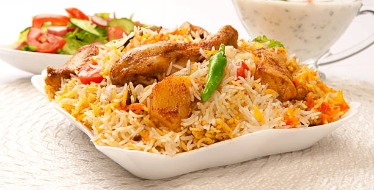
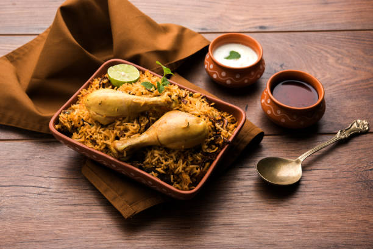

<a style="padding-right: 20px;"href="home.html">Home</a>
<a style="padding-right: 20px;"href="about.html">About</a>
<a style="padding-right: 20px;"href="services.html">Services</a>

<h1 style="font-size:50px;text-align:center;">A new taste in Biryani</h1>

Biryani is a mixed rice 
dish popular in SouthAsia,made with rice, meat or seafood, and spices. To cater to vegetarians,
the meat or seafood canbe substituted with vegetables or paneer. 
Sometimes eggs or potatoes are also added.

<a style="font-size:20px;background-color: red;padding:15px 35px 15px 35px;
color: white;"href="https://www.google.com/">Read more</a>

<h1 style="font-size:50px;text-align:center;">Different tastes</h1>

<h1 style="font-size:50px;text-align:center;">video making</h1>

<video src="video/Chicken Biryani.mp4" controls/>

		
